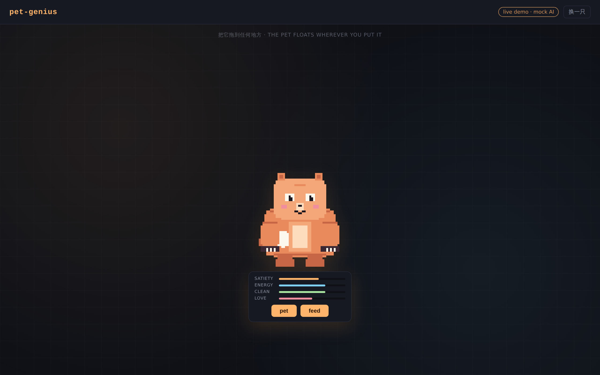

# pet-genius

> A personalized, AI-driven pet-spirit that lives wherever you put it — a draggable floating widget on any web page, or a transparent always-on-top window on your desktop. **Not a chat tool**: the model decides what the pet *does*, not what it *says*.

### ▶ Live demo

A keyless, server-less build of the web widget — customize a pet, drag it
around, hover for the status panel, watch it animate. Behavior is **canned**
(no LLM / API key); point the SDK at a real [`@pet-genius/server`](./packages/server)
for live AI-driven behavior.

- **Instant link** (pre-built bundle in [`docs/demo/`](./docs/demo), served
  straight from the public repo — no Pages, no Actions, no settings):
  [▶ open the demo](https://raw.githack.com/tronsfey/pet-genius/c4e217309ac2b5813a9b83bd4ac8413408318223/docs/demo/index.html)
  <sub>(SHA-pinned: the working branch name contains a `/`, which breaks
  githack's path parser, so the link points at a commit)</sub>
- **Stable URL** (once the [Pages workflow](./.github/workflows/pages.yml) is
  green — slash-free, auto-updates): [tronsfey.github.io/pet-genius](https://tronsfey.github.io/pet-genius/)

> Both need the repo **public** (Pages also needs Actions enabled; the githack
> link does not). Locally it always works: `pnpm --filter @pet-genius/demo dev`.



## What you get

- **Customizable identity.** Fill in a tiny form (name, palette, vibe, species hint, art style) → `gpt-image-1` generates a unique pixel / flat / watercolor / storybook creature → you own it.
- **AI-driven behavior.** Every ~10 s (jittered) the widget asks `gpt-4o-mini` what the pet should do next, given its current needs / mood / recent events. The model picks an animation clip and an optional one-line thought. Clicking `pet` / `feed` triggers local clips immediately and pokes the model for a follow-up reaction.
- **Pixel-perfect skeletal rig.** Each generated PNG is sliced into bones server-side; the client mounts them into a PixiJS Container hierarchy and animates keyframes with style-aware easing.
- **Lives anywhere.** The PixiJS canvas is fully transparent — drag the pet to any position on a web page, or run it as a transparent always-on-top desktop window via the Tauri shell.

## Packages

| Package                                      | What it is                                                                                       |
| -------------------------------------------- | ------------------------------------------------------------------------------------------------ |
| [`@pet-genius/shared`](./packages/shared)    | Types, zod schemas, art-style config, default animation clips. Zero deps but zod.                |
| [`@pet-genius/server`](./packages/server)    | `createPetGeniusApp({ openaiApiKey })` Hono factory exposing `/api/sprite` and `/api/action`.    |
| [`@pet-genius/widget`](./packages/widget)    | `summonPet({ host, apiBase })` browser SDK with imperative handle and event subscriptions.       |

Plus reference consumer apps under `apps/`:
- [`apps/demo`](./apps/demo) — a Vite + Hono web demo.
- [`apps/desktop`](./apps/desktop) — a Tauri 2 wrapper for Win/macOS/Linux.

## Three-line integration

```ts
import { summonPet } from '@pet-genius/widget';
import '@pet-genius/widget/styles.css';

const pet = summonPet({
  host: document.getElementById('pet-mount')!,
  apiBase: 'https://my-pet-api.example.com',
});
```

```ts
// On your Node server
import { createPetGeniusApp } from '@pet-genius/server';
app.route('/pet', createPetGeniusApp({ openaiApiKey: process.env.OPENAI_API_KEY! }));
```

See [`docs/INTEGRATION.md`](./docs/INTEGRATION.md) for the full walkthrough including persistence options, art style customization, and the local test-pet fallback for offline dev.

## Develop the SDK

```sh
pnpm install
pnpm dev               # runs apps/demo (Vite + Hono)
pnpm test
pnpm typecheck
pnpm lint
pnpm -r build          # build all three packages' dist/
```

## Project rules

See [`CLAUDE.md`](./CLAUDE.md) for the architecture, type contract, server contract, animation runtime, and conventions in detail. Notably:

- **It is not a chat tool.** Do not reintroduce a chat panel.
- The model output is `{ animation, intensity, thought? }`, never free-form dialogue.
- API keys live in `.env.local` only (gitignored). Server-side only. Never in client JS.
- All AI-affecting wire shapes pass through zod at every boundary.

## License

MIT.
